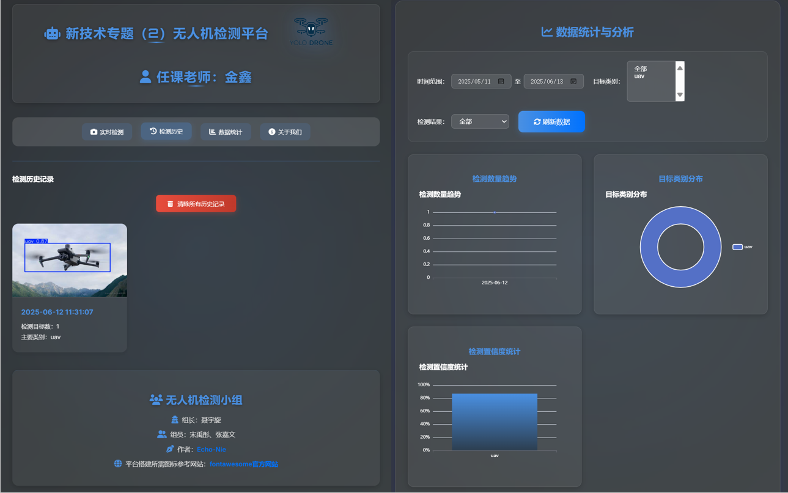
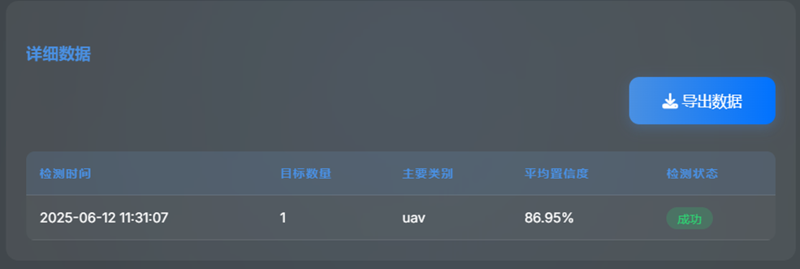

# YOLO-Drone: Object Detection Platform Based on YOLOX

> **Project Name: YOLO-Drone**  
>
> **Full Name: Object Detection and Visualization System Based on YOLO Series**
>
> **Description:** *Developed and maintained by the YOLO-Drone team — Group of Course "New Technologies Topics (2)" instructed by Jin Xin*
>
> **Why we made it: Just for fun. 😄**
>
> *License: MIT*
>
> *GitHub Repository: [Echo-Nie/Drone-inspection-platform: Just for fun](https://github.com/Echo-Nie/Drone-inspection-platform)*
> 
> 🚀💻 Since I've already forgotten how to write Vue, I'm currently sticking to the basic front-end trio (HTML, CSS, JS). I plan to refactor and maintain the code using Vue after October! 

<p align="center">
  
</p>

<div align="center">
  


</div>

<div align="center">
  


</div>


## 🔍 Project Overview

This project is a lightweight object detection platform built upon **YOLO Series**, supporting image upload, model inference, result visualization, and historical record querying. The frontend is implemented using HTML + CSS + JavaScript for interactive user experience, while the backend is powered by Flask to provide robust web services. The overall architecture is simple and efficient, suitable for real-world applications such as drone aerial image analysis and intelligent surveillance.

We base our implementation on the [Ultralytics YOLO](https://github.com/ultralytics/ultralytics) open-source framework, utilizing the pre-trained `yolo_x.pt` model. The complete detection pipeline is integrated into the Flask platform, enabling an end-to-end workflow from image upload to result display.


## 🛠️ Tech Stack

| Category                    | Technology / Tool                                   |
| --------------------------- | --------------------------------------------------- |
| **Deep Learning Framework** | PyTorch, Ultralytics YOLO                           |
| **Model Version**           | YOLOv_x                                             |
| **Backend Service**         | Flask                                               |
| **Frontend**                | HTML5 + CSS3 + JavaScript                           |
| **Image Processing**        | OpenCV                                              |
| **Data Storage**            | JSON Files (for storing detection history)          |
| **Deployment Dependencies** | Werkzeug (file upload), Jinja2 (template rendering) |


## 📦 Project Structure

```bash
YOLO-Drone/
├── assets/                   # Contains static resources used in the README (e.g., images, icons)
├── models/                   # Stores trained machine learning model files (e.g., uav.pt, yolov9c.pt)
├── routes/                   # Contains routing logic for defining API or page access paths
├── services/                 # Business logic modules: detection, history, data statistics, etc.
├── static/                   # Static resource directory (directly accessible by the frontend)
│   ├── css/                  
│   ├── js/                  
│   └── results/              # Stores output images from object detection
│       └── detect/           # Subdirectory for detection results; stores images generated during detection
├── templates/                # Frontend HTML templates used to render web content
├── uploads/                  # Directory for storing user-uploaded files
├── app.py                    # Starts the web server
├── config.py                 # Configuration file
├── requirements.txt          # List of Python dependencies required for the project
└── detection_history.json    # File that records detection history (e.g., timestamps, results)
```


## 🚀 Quick Start

**Install Dependencies**

```bash
pip install -r requirements.txt
```

**Launch the Server**

```bash
python app.py
```


## 👉 UI Display

Visit `http://localhost:5000` to access the object detection platform.

<p align="center">
  
</p>

<p align="center">
  
</p>

<p align="center">
  
</p>

<p align="center">
  
</p>

## 🖥️ Core Features

- ✅ Image Upload and Real-Time Detection  
- ✅ Detection Result Visualization (bounding boxes, class labels, confidence scores)  
- ✅ Detection Statistics Display (total objects, average confidence, per-class counts)  
- ✅ Detection History Management (automatically saves timestamp, image link, and detected objects)  
- ✅ Multi-Page Navigation (Home / History / About Us)


## 💡 Acknowledgments

Special thanks to the following open-source projects:

- [Ultralytics YOLO](https://github.com/ultralytics/ultralytics) — Efficient YOLO model implementation  
- [Flask](https://flask.palletsprojects.com/) — Lightweight web framework  
- [OpenCV](https://opencv.org/) — Core image processing library  
- [Werkzeug](https://palletsprojects.com/p/werkzeug/) — Flask dependency for file upload management  


## 🧩 Future Enhancements

- Support for real-time video stream detection (e.g., RTSP, webcam input)  
- Use SQLite or MongoDB for persistent detection history storage  
- ✅ (In Test) Expose model as an API for integration with other systems 
- ❌ Deploy to cloud or server for public access(Temporarily offline )
- ✅ (In Test) Support for real-time video stream detection (e.g., RTSP, webcam input)
- ✅ Complete the mobile device adaptation.


## 🤝 How to Contribute
We welcome all forms of contributions to make YOLO-Drone even better! Here are some ways you can contribute:

- 🐛 Report Issues: If you encounter any bugs or have suggestions for new features, please open an issue on our Issue Page. Your feedback helps us improve the project!
- 🚀 Submit Pull Requests: If you'd like to contribute code, please fork the repository and submit a pull request. We appreciate your efforts in making the codebase better!
- 📝 Document Enhancement: You can help us improve the documentation by correcting typos, adding more details, or making it more readable. Every small improvement counts! 😊
- 📧 Contact Us: If you have any questions or just want to chat about the project, feel free to contact us via [](mailto:nieyuxuan6@gmail.com)
- 🌠 If you find this project helpful, please give it a star!⭐

Your support and contributions are greatly appreciated! 🌟
