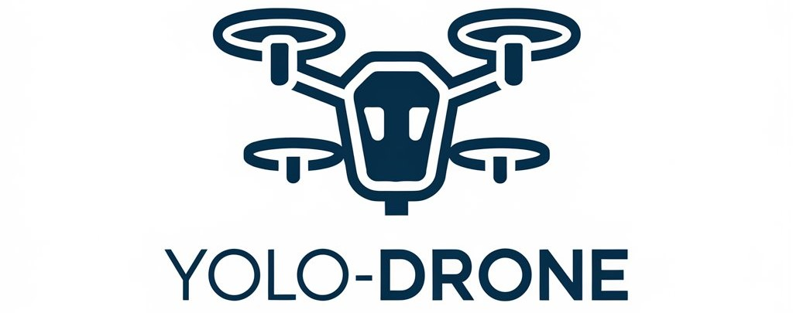
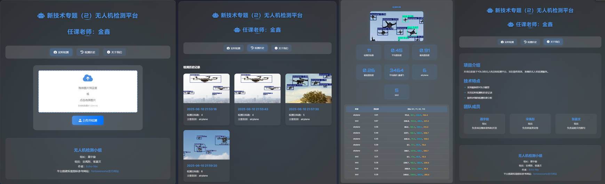

# YOLO-Drone: Object Detection Platform Based on YOLOX

> **Project Name: YOLO-Drone**  
>
> **Full Name: Object Detection and Visualization System Based on YOLO Series**
>
> **Description: ** *Developed and maintained by the YOLO-Drone team — Group of Course "New Technologies Topics (2)" instructed by Jin Xin*
>
> **Why we made it: Just for fun. 😄**
>
> *License: MIT*
>
> *GitHub Repository: [Echo-Nie/Drone-inspection-platform: Just for fun](https://github.com/Echo-Nie/Drone-inspection-platform)*

<p align="center">
  
</p>


## 🔍 Project Overview

This project is a lightweight object detection platform built upon **YOLO Series**, supporting image upload, model inference, result visualization, and historical record querying. The frontend is implemented using HTML + CSS + JavaScript for interactive user experience, while the backend is powered by Flask to provide robust web services. The overall architecture is simple and efficient, suitable for real-world applications such as drone aerial image analysis and intelligent surveillance.

We base our implementation on the [Ultralytics YOLO](https://github.com/ultralytics/ultralytics) open-source framework, utilizing the pre-trained `yolo_x.pt` model. The complete detection pipeline is integrated into the Flask platform, enabling an end-to-end workflow from image upload to result display.


## 🛠️ Tech Stack

| Category                    | Technology / Tool                                   |
| --------------------------- | --------------------------------------------------- |
| **Deep Learning Framework** | PyTorch, Ultralytics YOLO                           |
| **Model Version**           | YOLOv_x                                             |
| **Backend Service**         | Flask                                               |
| **Frontend**                | HTML5 + CSS3 + JavaScript                           |
| **Image Processing**        | OpenCV                                              |
| **Data Storage**            | JSON Files (for storing detection history)          |
| **Deployment Dependencies** | Werkzeug (file upload), Jinja2 (template rendering) |


## 📦 Project Structure

```bash
YOLO-Drone/
│
├── static/                   # Static resources directory (images, CSS, etc.)
│   └── css/
│   └── js/
│   └── results/              # Stores detection output images
│       └── detect/           # Detection result folder
├── templates/                # Frontend HTML templates
├── app.py                    # Main Flask application
├── yolov9c.pt                # Pre-trained YOLOv9 model weights
├── requirements.txt          # Dependency list
└── detection_history.json    # File for saving detection history
```


## 🚀 Quick Start

**Install Dependencies**

```bash
pip install -r requirements.txt
```

**Launch the Server**

```bash
python app.py
```


## 👉 UI Display

Visit `http://localhost:5000` to access the object detection platform.

<p align="center">
  
</p>

<p align="center">
  
</p>


## 🖥️ Core Features

- ✅ Image Upload and Real-Time Detection  
- ✅ Detection Result Visualization (bounding boxes, class labels, confidence scores)  
- ✅ Detection Statistics Display (total objects, average confidence, per-class counts)  
- ✅ Detection History Management (automatically saves timestamp, image link, and detected objects)  
- ✅ Multi-Page Navigation (Home / History / About Us)


## 💡 Acknowledgments

Special thanks to the following open-source projects:

- [Ultralytics YOLO](https://github.com/ultralytics/ultralytics) — Efficient YOLO model implementation  
- [Flask](https://flask.palletsprojects.com/) — Lightweight web framework  
- [OpenCV](https://opencv.org/) — Core image processing library  
- [Werkzeug](https://palletsprojects.com/p/werkzeug/) — Flask dependency for file upload management  


## 🧩 Future Enhancements

- Support for real-time video stream detection (e.g., RTSP, webcam input)  
- Add user login and permission management system  
- Use SQLite or MongoDB for persistent detection history storage  
- Expose model as an API for integration with other systems  
- Deploy to cloud or server for public access  
